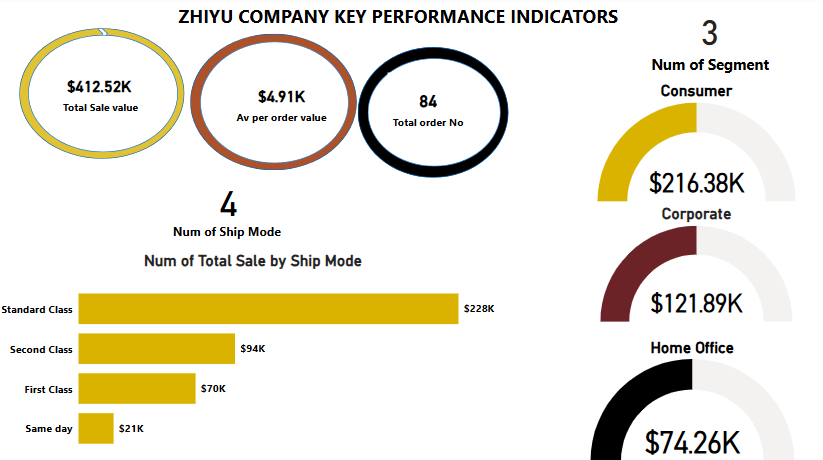

# ABOUT ME

Hello! I'm Deborah Omeke 🤓, a detail driven data analyst, with a strong foundation in Excel and Power BI, passionate about transforming raw data into meaningful insights that drive decision-making. I specialize in data cleaning, dashboard creation, and data visualization. My analytical mindset and attention to detail allow me to uncover trends and patterns that help businesses make smarter decisions. I'm committed to continuous learning and leveraging data to tell compelling stories.

#SKILLS

1. Proficient in data cleaning, processing and exploratory data analysis (EDA) using Excel and Power BI
2. Experience building interactive dashboards and reports using Excel and Power BI
3. Excellent communication and data storytelling skills and ability to translate complex data insights into actionable recommendations.

# My Projects

Below are some of the projects I have worked on.

## Analysis of B&J Biscuits and Bakery Sales Data – 2024

	

B&J Biscuits and Bakery is renowned for its delicious range of biscuits and cakes. From its iconic Cookies to its
indulgent Peanut Butter Bites, B&J Biscuits and Bakery offers a wide variety of treats loved by people worldwide.
In 2024, The company pushed out ten different biscuit brands to Chicago, Dallas, Houston, Los Angeles, New York,
Philadelphia, Pheonix, San Anthonio, San Diego, and San Jose to stand out amongst their competitors in the biscuit
market. Assigning eight sales representatives to deliver the sales of products in these locations.
[Read More](B&J_Biscuits_and_Bakery_Data_Report.pdf)

## ZHIYU Shipping Company Sales Data Analysis

	

ZHIYU Shipping Company deals with the transport of a parcel to its destination; they offer flexible, reliable delivery options for shipping quality craft and are responsible for the efficient and seamless movement of cargo, overseeing the logistics, navigation, and overall operation of their fleets.
[Read More](ZHIYU_Shipping_Company_Documentation.pdf)

# Contact Me

|----------|----------|
| 📩   |   [deborahtobi99@gmail.com](mailto:deborahtobi99@gmail.com)  	 | 	
| 📞   |   [2348107779376](https://wa.me/2348107779376)  	  	 |		
| 🗃️	| 	[View Resume](my_resume.pdf)				  				 |		

